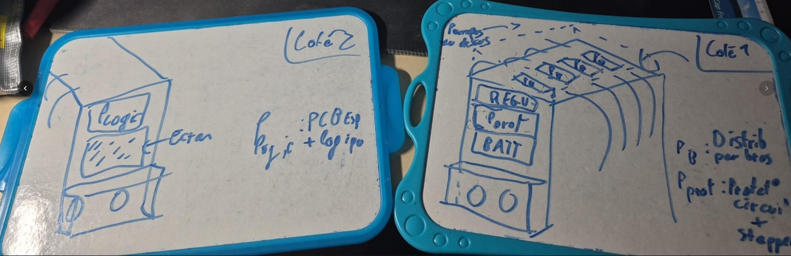
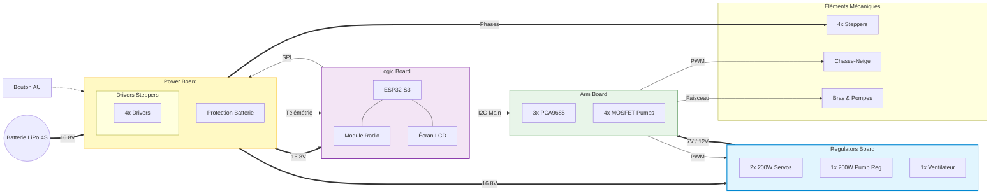
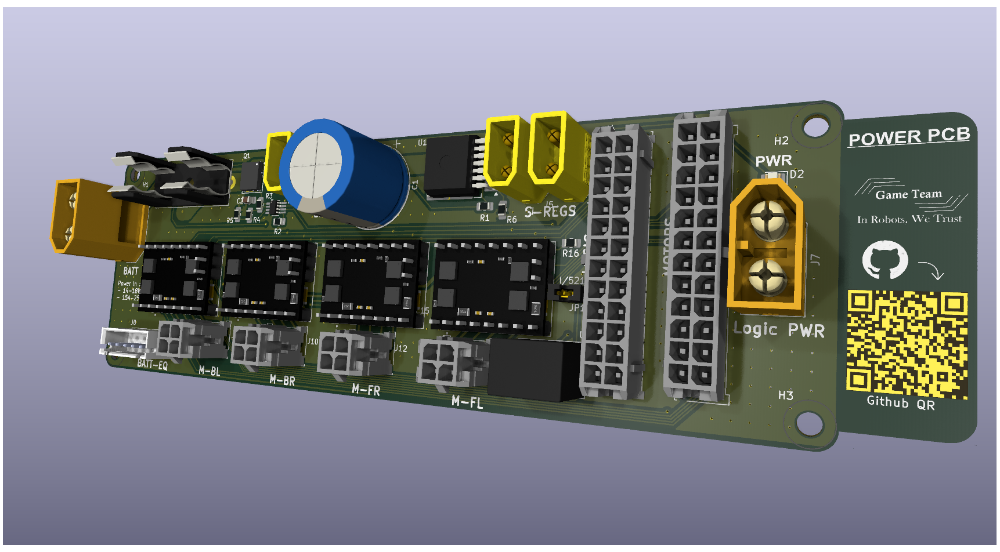

# Game Team's Eurobot 2026 Robot

## Hardware

### Architecture Diagram

```mermaid
graph LR
    %% SOURCES EXTERNES
    Batt((Batterie LiPo 4S))
    BAU[Bouton AU]

    %% PCB 1: LOGIC BOARD
    subgraph LB [Logic Board]
        direction TB
        MCU[ESP32-S3]
        Radio[Module Radio]
        Screen[Écran LCD]
        MCU --- Radio
        MCU --- Screen
    end

    %% PCB 2: POWER BOARD
    subgraph PB [Power Board]
        direction TB
        Prot[Protection Batterie]
        subgraph Drivers [Drivers Steppers]
            D_4x[4x Drivers]
        end
    end

    %% PCB 3: SERVO REGULATORS (Considéré comme un bloc PCB)
    subgraph Regs [Regulators Board]
        direction TB
        SR[2x 200W Servos]
        PR[1x 200W Pump Reg]
        Fan[1x Ventilateur]
    end

    %% PCB 4: ARM BOARD
    subgraph AB [Arm Board]
        direction TB
        PCA[3x PCA9685]
        Mos[4x MOSFET Pumps]
    end

    %% MATÉRIEL PHYSIQUE (Hors PCB)
    subgraph Mecanique [Éléments Mécaniques]
        Mots[4x Steppers]
        CN[Chasse-Neige]
        Bras[Bras & Pompes]
    end

    %% CONNEXIONS INTER-PCB (Puissance)
    Batt == "16.8V" ==> PB
    PB == "16.8V" ==> LB
    PB == "16.8V" ==> Regs
    Regs == "7V / 12V" ==> AB
    BAU -.-> PB
    AB -- PWM -->Regs

    %% CONNEXIONS INTER-PCB (Signaux)
    LB -- "SPI" --> PB
    LB -- "I2C Main" --> AB
    PB -- "Télémétrie" --> LB

    %% CONNEXIONS PCB VERS MÉCANIQUE
    PB == "Phases" ==> Mots
    AB -- "PWM" --> CN
    AB -- "Faisceau" --> Bras

    %% STYLES
    style LB fill:#f3e5f5,stroke:#7b1fa2,stroke-width:2px
    style PB fill:#fff9c4,stroke:#fbc02d,stroke-width:2px
    style Regs fill:#e1f5fe,stroke:#0288d1,stroke-width:2px
    style AB fill:#e8f5e9,stroke:#2e7d32,stroke-width:2px
```

### Power PCB

